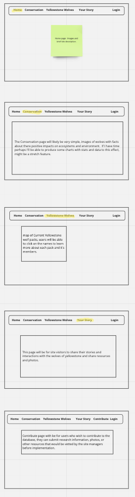
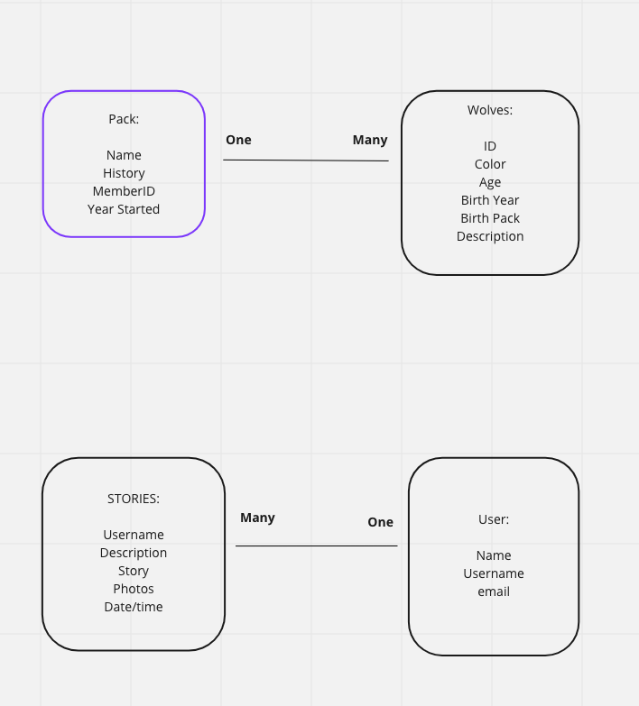

## Wolf Conservation Project

- This app is meant to be a resource for anyone interested in learning more about wolf conservation, the current wolves of Yellowstone National Park, and a place to share their own experiences.   This site will have infortaion on the the benefits wolves have on their ecosystems and environment, as well as information on the the packs and pack member of the  Current Yellowstone wolf packs.  Additionally users who create logins will have be able to share their own experiences with others by writing about their story and posting photographs. 

##  Project Plan

- I will use Django to build a front and backend, I will cite existing sites and resources to build my own database.  Users will be able to share their stories but will have to submit a contact form to make any amendments to the database, those changes will need to be executed by a site adminitstrator. 

## Wireframe 

## MODELS

## User Story

- Users will have multiple options when interacting with this site, they can simple browse and learn about wolf conservation in general, learn about the current wolf packs of yellowstone, or choose to share their own experiences and even request to ammend or add to the database. 

## MVP

- Create Database with Wolf Information and map of pack locations in the park. Full CRUD
- Create page with conservation information
- Story page for users to share their stories also FULL CRUD
- User Auth

## Stretch Goals

- Data visualization on the impact of wolf environmental impact
- Figure out how to make database CRUD admin user only, or only accessible to certain user IDs. 
- Allow users to upload locally stored photos, not just photo URLs. 
