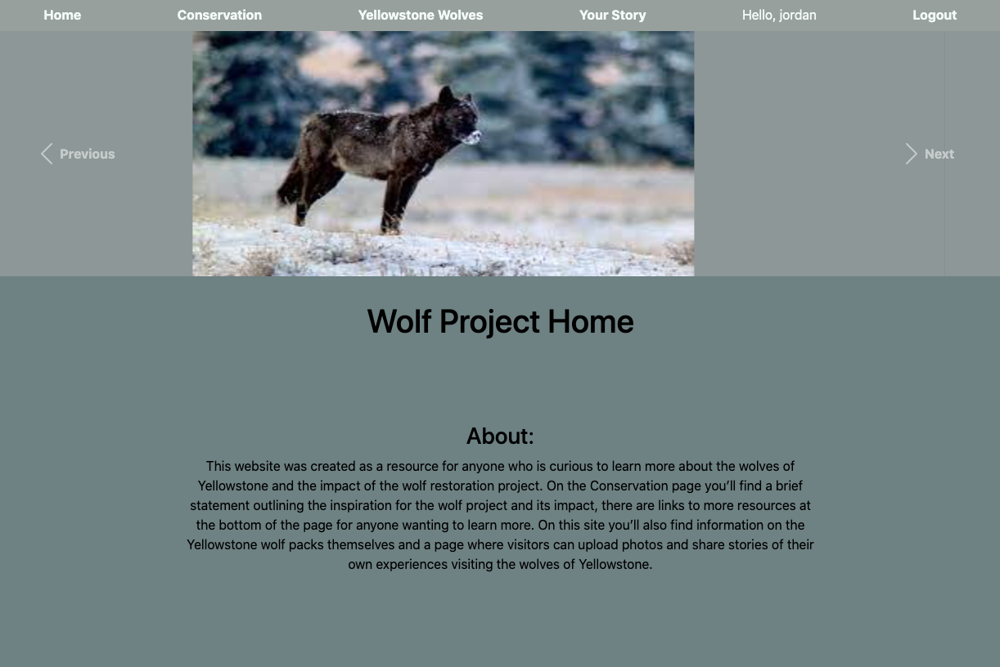
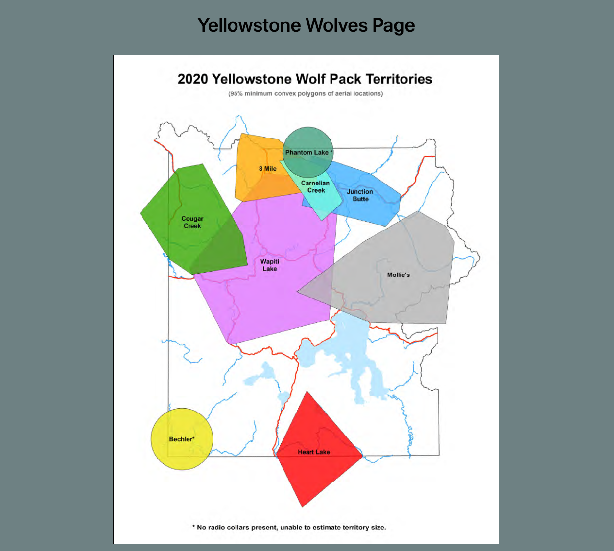
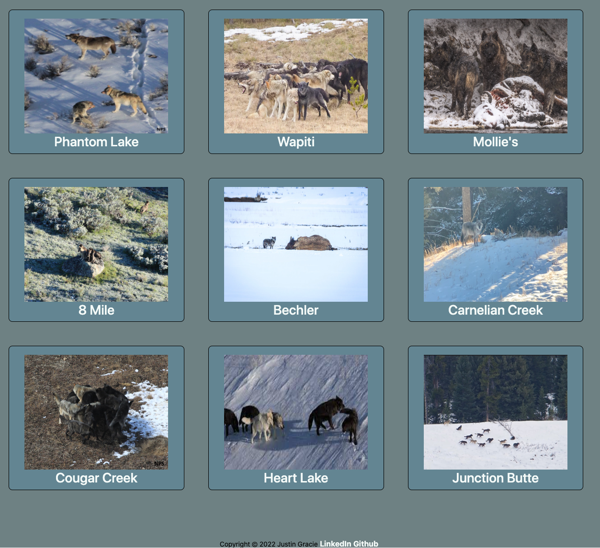
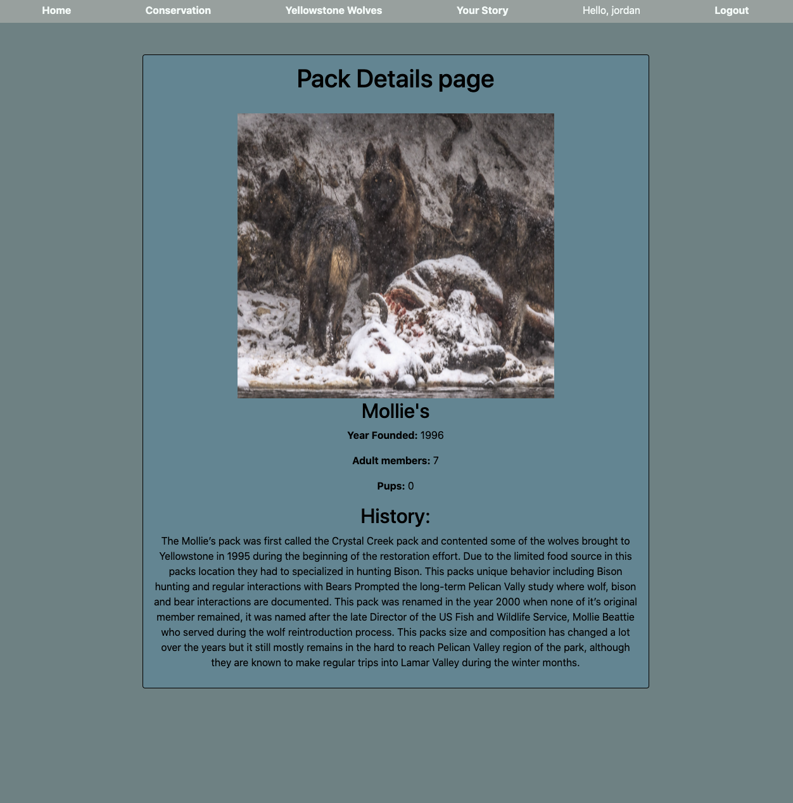
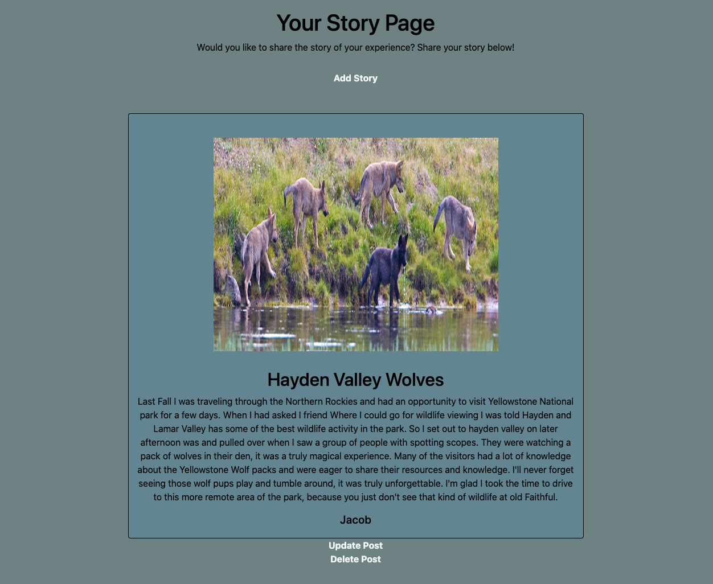

## Wolf Conservation Project

This app is meant to be a resource for anyone interested in learning more about wolf conservation, the current wolves of Yellowstone National Park, and a place to share their own experiences.   This site will have infortaion on the the benefits wolves have on their ecosystems and environment, as well as information on the the packs and pack member of the  Current Yellowstone wolf packs.  Additionally users who create logins will be able to share their own experiences with others by writing about their story and posting photographs. 

##  Images of Site

## Visit deployed Site Here

https://django-test-wolf.herokuapp.com/

## Tech Used

Python, Django, postgresql, Grid, bootstrap

## Next Steps

- I'm still working on refining user auth, I started experimenting with django guardian and need to work on that a little more to protect the Edit and Delete routes so only the users who create a post can edit or delete their posts.

- In a future version I'd also like to implment React to refine the front end and update the design. 

- I'd also like to grow the database to include previous wolf packs and individual wolf information. 

## Contribution guidelines

If you would like to contribute to this project just fork, clone and submit a pull request and I will review any changes.  If you run into any bugs please submit an issue so I can review and remedy. 

## References

- https://docs.djangoproject.com/en/4.0/ref/models/fields/#filefield
- https://stackoverflow.com/questions/36665889/collectstatic-error-while-deploying-django-app-to-heroku
- https://www.geeksforgeeks.org/python-uploading-images-in-django/
- https://docs.djangoproject.com/en/4.0/topics/auth/default/#permissions-and-authorization
- https://coderbook.com/@marcus/how-to-restrict-access-with-django-permissions/
- https://stackoverflow.com/questions/34750151/nameerror-name-post-is-not-defined
- https://getbootstrap.com/docs/4.0/components/carousel/
